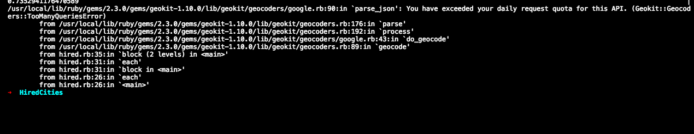

# Hired Cities

### Up And Running

`git clone`

`bundle install`

`ruby hired.rb`

### What's Happening

To find the distance between two latitude/longitude coordinates on the globe,
we must compute a non-euclidean distance called [orthodromic distance](https://www.wikiwand.com/en/Great-circle_distance).
This is abstracted away in the geokit ruby gem I used which did the mathematical heavy lifting.

We first do a single pass through all 16 cities and query the google maps api, storing
all the returned objects in the cities_geocode hash.

As new distances between all the 2-permutations of our 16 cities are calculated,
they are stored in a hash with an 2D-array serving as our key.

`		@cities_hash = Hash.new {|hash, key| hash[key] = key } `

Finally, our hash is sorted by value with the least distance and then
the corresponding city pair will be our key, and our answer.

**NOTE**

- If you are greeted with the ever annoying quota exceeded error then I am truly sorry.
	- *Try changing* `CONFIG['api_key']` *to* `CONFIG['api_key2']` *to fix the issue.*

### Fun along the way 😅

### External gems

* geokit (wrapper around Google Maps API)
* ruby-progressbar
